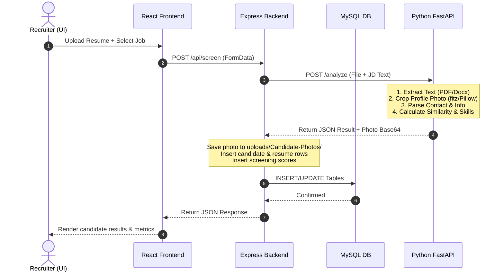

# RecruitAI — Resume Screener & Intelligence System

RecruitAI is a modern, high-performance web application designed for executive, technical, and high-volume recruiting. By combining a rich client-side dashboard, an Express.js orchestration backend, and a specialized Python NLP engine, RecruitAI parses resumes (PDF/DOCX), extracts candidate details (including profile photos), matches qualifications against job descriptions, and provides structured scores and skill gap analyses.

---

## 🏗️ Project Architecture & Breakdown

The repository is structured as a monorepo consisting of four main directories:

```
ResumeScreener/
├── frontend/           # React 19 SPA powered by Vite & Tailwind CSS
├── backend/            # Express.js (Node.js) server connecting to MySQL
├── ai-layer/           # FastAPI (Python) service running NLP & similarity models
└── mysql-schema/       # Pure SQL schemas for database setup
```

### 1. Frontend (`frontend/`)
* **Core Technology:** React 19, Vite, and Tailwind CSS.
* **Animations & Transitions:** `framer-motion` for page changes and micro-animations.
* **Authentication:** Integrates Firebase Auth for client-side authentication, password reset, and email verification.
* **API Client:** Axios-based client (`api.js`) featuring auto-injected JWT authorization headers and centralized toast notifications.
* **Pages:**
  * **Dashboard:** At-a-glance KPI metrics, active jobs list, and recent screening updates.
  * **Screening:** Interactive drag-and-drop resume upload zone (PDF/DOCX).
  * **Candidates List:** Dynamic table featuring search filters, recruitment stage changes, and average score calculations.
  * **Candidate Profile:** Comprehensive page showing candidate details (contact, photo, experience, education), visual match scores, missing/matched skills lists, and custom recruiter notes.
  * **Jobs Management:** Creation and versioning of Job Descriptions. When a JD is edited, it triggers a cascade warning that old candidates can be automatically rescreened against the updated JD version.
  * **Analytics / Results:** Charting and analytical breakdown of candidate scores filtered by job role.

### 2. Backend (`backend/`)
* **Core Technology:** Node.js, Express.js.
* **Database Driver:** `mysql2` connection pooling.
* **Authentication:** JWT-based session validation. Synchronized with Firebase Auth (e.g. falls back to registering users in MySQL if they exist only in Firebase, and handles password/email updates).
* **Upload Handler:** `multer` configures file destination folders for CVs and cropped candidate photos.
* **AI Orchestrator:** Proxies files and Job Descriptions to the Python AI service using `form-data`.

### 3. AI Layer (`ai-layer/`)
* **Core Technology:** Python 3, FastAPI, Uvicorn.
* **Parsing Engine:** `PyPDF2` and `python-docx` extract raw text.
* **Entity & Detail Extractor:** Heuristic regex patterns pull candidate names, emails, phones, years of experience, and highest educational degrees.
* **Image Processor:** Uses `PyMuPDF` (fitz) and `Pillow` to scan documents, score images based on aspect-ratio and size parameters to filter out corporate logos, and crops candidate profile photos.
* **NLP & Scoring Engines:**
  * **Skill Extractor:** Matches candidate resume words against a custom skills database (`skills_database.csv`) while supporting alias mappings (e.g., "JS" ➡️ "JavaScript").
  * **Similarity Engine:** Preprocesses text and applies a TF-IDF vectorization cosine similarity algorithm.
  * **Scoring Formula:** Weighted algorithm combining Cosine Similarity, Skill Match ratios, and Keyword Bonuses (calculated for targeted terms like "Leadership", "Architect", etc.) to output a unified candidate score.

### 4. Database Schema (`mysql-schema/`)
Contains relational `.sql` files:
* `users`: Authentication records, role definitions, and company details.
* `candidates`: Basic candidate profile information (name, email, department, and cropped photo guid).
* `jobs`: Active positions, descriptions, versions, and statuses.
* `resumes`: Original files mapped to candidate keys and extracted textual representations.
* `screening_results`: AI scores, skill matching arrays (JSON), recruiter notes, and rescreening tags.

---

## 🔄 System & Data Flow



1. **Authentication Flow:** Users register/login through Firebase Auth in the frontend. On success, the client passes credentials to `/api/auth/login-firebase` where the backend verifies or creates the record in MySQL, signing a local JWT token for subsequent API calls.
2. **Screening Flow:** Resumes are sent from the client to `/api/screen`. The backend loads the selected job description, aggregates the payload, and sends it to the Python AI service at `localhost:8000/analyze`.
3. **AI Logic:** The Python parser returns extracted name/contact details, a cropped profile photo (if found), a keyword match bonus, and computed cosine similarity.
4. **Persistence & Presentation:** The backend writes the cropped photo to disk, enters records into `candidates`, `resumes`, and `screening_results` tables, and returns the response. The client state updates, instantly updating the Dashboard and Candidate lists.

---

## 💻 Local Installation & Setup

Follow these steps to set up and run RecruitAI on your local machine.

### Prerequisites
* **Node.js** (v18.x or higher)
* **Python** (v3.9.x to v3.11.x)
* **MySQL Server** (v8.0 or higher)
* **Git**

---

### Step 1: Database Initialization
1. Start your local MySQL instance.
2. Create a new schema named `resume_screener`:
   ```sql
   CREATE DATABASE resume_screener;
   ```
3. Import the schema files in the `mysql-schema/` directory in the following order (to respect foreign key constraints):
   ```bash
   mysql -u YOUR_USER -p resume_screener < mysql-schema/resume_screener_users.sql
   mysql -u YOUR_USER -p resume_screener < mysql-schema/resume_screener_candidates.sql
   mysql -u YOUR_USER -p resume_screener < mysql-schema/resume_screener_jobs.sql
   mysql -u YOUR_USER -p resume_screener < mysql-schema/resume_screener_resumes.sql
   mysql -u YOUR_USER -p resume_screener < mysql-schema/resume_screener_screening_results.sql
   ```

---

### Step 2: Backend Setup
1. Navigate to the `backend/` directory:
   ```bash
   cd backend
   ```
2. Install npm dependencies:
   ```bash
   npm install
   ```
3. Create a `.env` file in the `backend/` directory:
   ```env
   PORT=5000
   DB_HOST=localhost
   DB_USER=YOUR_MYSQL_USER
   DB_PASSWORD=YOUR_MYSQL_PASSWORD
   DB_NAME=resume_screener
   JWT_SECRET=recruit_ai_jwt_secret_token_key_123!
   PYTHON_API=http://127.0.0.1:8000/analyze
   ```
4. Run database migrations and seed default data (if applicable) or start the server:
   ```bash
   npm run dev
   ```
   *The backend will run on `http://localhost:5000`.*

---

### Step 3: AI Service Setup
1. Navigate to the `ai-layer/` directory:
   ```bash
   cd ../ai-layer
   ```
2. Create a virtual environment and activate it:
   * **Windows (PowerShell):**
     ```powershell
     python -m venv venv
     .\venv\Scripts\Activate.ps1
     ```
   * **macOS/Linux:**
     ```bash
     python3 -m venv venv
     source venv/bin/activate
     ```
3. Install Python packages:
   ```bash
   pip install -r requirements.txt
   ```
4. Run the Uvicorn FastAPI server:
   ```bash
   uvicorn main:app --reload --port 8000
   ```
   *The AI layer will run on `http://localhost:8000`.*

---

### Step 4: Frontend Setup
1. Navigate to the `frontend/` directory:
   ```bash
   cd ../frontend
   ```
2. Install client dependencies:
   ```bash
   npm install
   ```
3. Configure the Firebase Config in `frontend/src/config/firebase.js`. Verify the config fields match your Firebase console settings:
   ```javascript
   const firebaseConfig = {
     apiKey: "YOUR_API_KEY",
     authDomain: "YOUR_PROJECT.firebaseapp.com",
     projectId: "YOUR_PROJECT_ID",
     storageBucket: "YOUR_PROJECT.firebasestorage.app",
     messagingSenderId: "YOUR_MESSAGING_SENDER_ID",
     appId: "YOUR_APP_ID"
   };
   ```
4. Run the development server:
   ```bash
   npm run dev
   ```
   *The frontend will boot on `http://localhost:5173`.*

---

## 🛠️ Verification & Testing
* **Bypass Verification (Dev Mode):** In development mode (`npm run dev`), the signup screen provides a **Bypass Verification (Dev Only)** button. If your Firebase project SMTP verification emails land in spam or latency occurs, click this button to register a test user directly in the database and login instantly.
* **Upload Formats:** Use the PDF/DOCX templates under your local files to test resume screening against your created jobs.
* **Media Serving:** Extracted candidate photos are stored under `backend/uploads/Candidate-Photos` and served statically.
